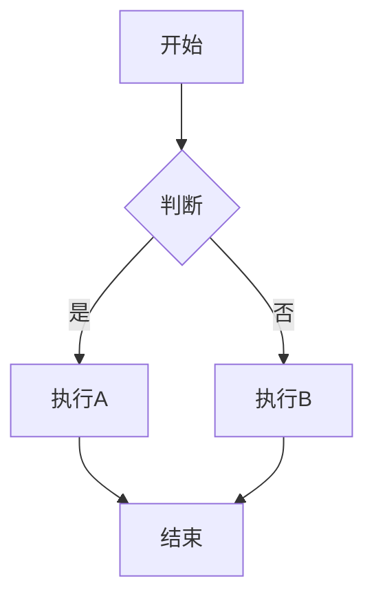

# Markdown 功能示例

本文档展示了 VuePress 支持的常用 Markdown 功能。

## 1. 代码块

### 1.1. 基础代码块

```javascript
function greet(name) {
  return `Hello, ${name}!`;
}

console.log(greet('VuePress'));
```

### 1.2. 带行号的代码块

```swift
class ViewController: UIViewController {
    override func viewDidLoad() {
        super.viewDidLoad()
        setupUI()
    }
    
    private func setupUI() {
        // 设置界面
    }
}
```

### 1.3. 内联代码

使用 `console.log()` 可以输出信息到控制台。

## 2. 表格

### 2.1. 基础表格

| 功能 | 支持情况 | 说明 |
|------|---------|------|
| 代码块 | ✅ | 支持语法高亮 |
| 表格 | ✅ | 支持对齐和格式化 |
| 高亮块 | ✅ | 支持多种类型 |
| 链接 | ✅ | 支持内部和外部链接 |
| 图片 | ✅ | 支持相对和绝对路径 |

### 2.2. 对齐表格

| 左对齐 | 居中 | 右对齐 |
|:-------|:----:|-------:|
| 内容1 | 内容2 | 内容3 |
| 较长的内容 | 中间 | 数字 123 |
| 短 | 中 | 456 |

### 2.3. 复杂表格

| 图表类型 | 用途 | 特点 |
|---------|------|------|
| Mermaid | 流程图、时序图 | 功能强大，语法简洁 |
| Chart.js | 数据可视化 | 轻量级，易于使用 |
| ECharts | 交互式图表 | 功能丰富，性能优秀 |
| PlantUML | UML 图表 | 服务端渲染，无需客户端库 |

## 3. 高亮块（提示框）

### 3.1. 信息提示

::: info 提示信息
这是一个信息提示框，用于展示一般性信息。
:::

### 3.2. 提示（Tip）

::: tip 小贴士
使用 VuePress 可以快速搭建文档网站，支持实时预览和热更新。
:::

### 3.3. 警告

::: warning 注意事项
修改配置文件后需要重启开发服务器才能生效。
:::

### 3.4. 危险警告

::: danger 危险操作
删除文件操作不可恢复，请谨慎操作！
:::

### 3.5. 详细信息

::: details 点击展开查看详情
这里可以放置详细的内容，默认是折叠状态。

- 支持多行内容
- 支持列表
- 支持代码块

```javascript
// 甚至可以在详情块中使用代码
const example = 'Hello';
```
:::

## 4. 列表

### 4.1. 无序列表

- 第一项
- 第二项
  - 嵌套项 1
  - 嵌套项 2
- 第三项

### 4.2. 有序列表

1. 第一步：安装依赖
2. 第二步：配置插件
3. 第三步：启动服务器
   1. 检查端口是否被占用
   2. 运行 `npm run docs:dev`

### 4.3. 任务列表

- [x] 完成 VuePress 集成
- [x] 转换所有 HTML 笔记为 Markdown
- [x] 配置图表插件
- [ ] 添加更多示例内容
- [ ] 优化样式和布局

## 5. 引用

### 5.1. 单层引用

::: info
这是一段引用文字。
可以包含多行内容。
:::

### 5.2. 嵌套引用

::: info
第一层引用
> 第二层引用
>
> > 第三层引用
:::

## 6. 强调

**粗体文字**

*斜体文字*

***粗斜体文字***

~~删除线文字~~

## 7. 链接和图片

### 7.1. 内部链接

- [首页](/)
- [图表示例](./图表示例.md)
- [内存管理笔记](./内存管理/01-iOS对象的内存布局.md)

### 7.2. 外部链接

- [VuePress 官网](https://v2.vuepress.vuejs.org/)
- [Vue.js 官网](https://vuejs.org/)

### 7.3. 图片


## 8. 分割线

---

## 9. 数学公式（如果支持）

行内公式：$E = mc^2$

块级公式：

$$
\sum_{i=1}^{n} i = \frac{n(n+1)}{2}
$$

## 10. 图表示例

### 10.1. Mermaid 流程图



### 10.2. Chart.js 图表

::: chartjs 示例图表

```json
{
  "type": "bar",
  "data": {
    "labels": ["A", "B", "C"],
    "datasets": [{
      "label": "数据",
      "data": [10, 20, 15]
    }]
  }
}
```

:::

## 11. HTML 标签

VuePress 支持在 Markdown 中使用 HTML 标签：

<div style="background-color: #f0f0f0; padding: 10px; border-radius: 5px;">
这是一个使用 HTML 标签的样式块。
</div>

## 12. 转义字符

如果需要显示 Markdown 语法本身，可以使用反斜杠转义：

\*\*这不是粗体\*\*

\`这不是代码\`

## 13. 脚注

这是一个带脚注的句子[^1]。

这是另一个脚注[^note]。

[^1]: 这是第一个脚注的内容。
[^note]: 这是第二个脚注的内容，可以包含**格式化**文字。

## 14. 定义列表

术语1
: 这是术语1的定义。

术语2
: 这是术语2的定义。
: 可以包含多个定义。

## 15. 代码块中的语言标识

支持多种语言的语法高亮：

```python
def hello():
    print("Hello, World!")
```

```java
public class Hello {
    public static void main(String[] args) {
        System.out.println("Hello, World!");
    }
}
```

```objective-c
- (void)viewDidLoad {
    [super viewDidLoad];
    NSLog(@"Hello, World!");
}
```

## 16. 总结

VuePress 支持丰富的 Markdown 功能，包括：

- ✅ 代码块和语法高亮
- ✅ 表格
- ✅ 高亮块（提示框）
- ✅ 列表（有序、无序、任务列表）
- ✅ 引用
- ✅ 强调（粗体、斜体、删除线）
- ✅ 链接和图片
- ✅ 图表（Mermaid、Chart.js、ECharts 等）
- ✅ HTML 标签
- ✅ 脚注
- ✅ 定义列表

这些功能可以帮助你创建丰富、美观的文档内容。
