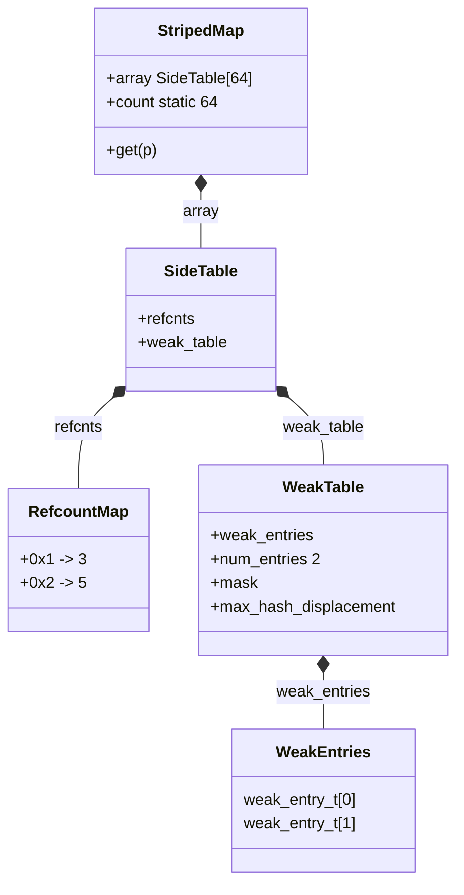
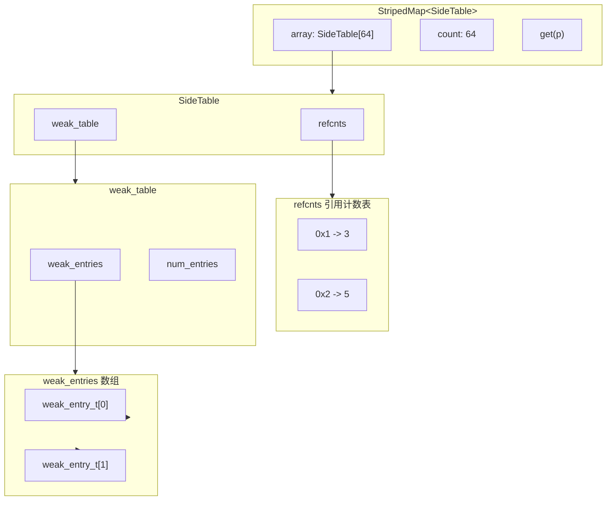
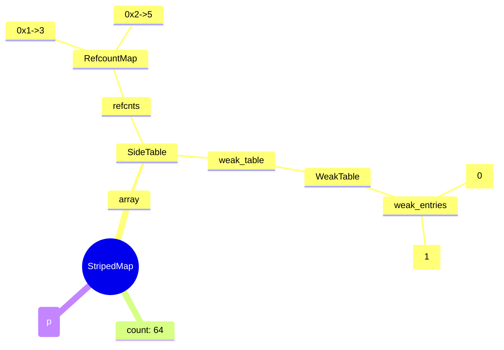

# SideTable 结构 - 现有组件示例

本文档用 VuePress 已集成的图表组件（Mermaid、PlantUML、Markmap）来展示 SideTable 的层级结构，方便与组件 1 的效果对比。

---

## 1. Mermaid 类图（classDiagram）

用 UML 类图表达「包含/指向」关系：



---

## 2. Mermaid 流程图（flowchart）

用流程图表达层级关系：



---

## 3. Mermaid 思维导图（mindmap）

用思维导图表达层级：



---

## 4. PlantUML 类图

```uml
@startuml
skinparam classAttributeIconSize 0

class StripedMap {
  array : SideTable[64]
  count : static 64
  get(p)
}

class SideTable {
  refcnts
  weak_table
}

class RefcountMap {
  0x1 -> 3
  0x2 -> 5
}

class WeakTable {
  weak_entries
  num_entries
  mask
  max_hash_displacement
}

class "weak_entries" as WeakEntries {
  weak_entry_t[0]
  weak_entry_t[1]
}

StripedMap *-- SideTable : array
SideTable *-- RefcountMap : refcnts
SideTable *-- WeakTable : weak_table
WeakTable *-- WeakEntries : weak_entries
@enduml
```

---

## 5. PlantUML 组件图

```uml
@startuml
package "StripedMap<SideTable>" as SM {
  [array: SideTable[64]] as array
  [count: 64]
  [get(p)]
}

package "SideTable" as ST {
  [refcnts] as refcnts
  [weak_table] as weak_table
}

package "refcnts" as RC {
  [0x1 -> 3]
  [0x2 -> 5]
}

package "weak_table" as WT {
  [weak_entries] as we
  [num_entries: 2]
}

package "weak_entries" as WE {
  [weak_entry_t[0]]
  [weak_entry_t[1]]
}

array --> ST
refcnts --> RC
weak_table --> WT
we --> WE
@enduml
```

---

## 对比说明

| 方式 | 优点 | 缺点 |
|------|------|------|
| **Mermaid 类图** | 语法简单，关系清晰 | 不能精确到「某一行」的箭头 |
| **Mermaid 流程图** | 层级直观 | 块内字段展示不够细 |
| **Mermaid 思维导图** | 层级一目了然 | 不适合表达「字段→结构」的指向 |
| **PlantUML** | 表达力强 | 语法稍复杂，需配置 |

以上方式都无法做到组件 1 那种「表格块 + 行级箭头」的精确指向效果。
