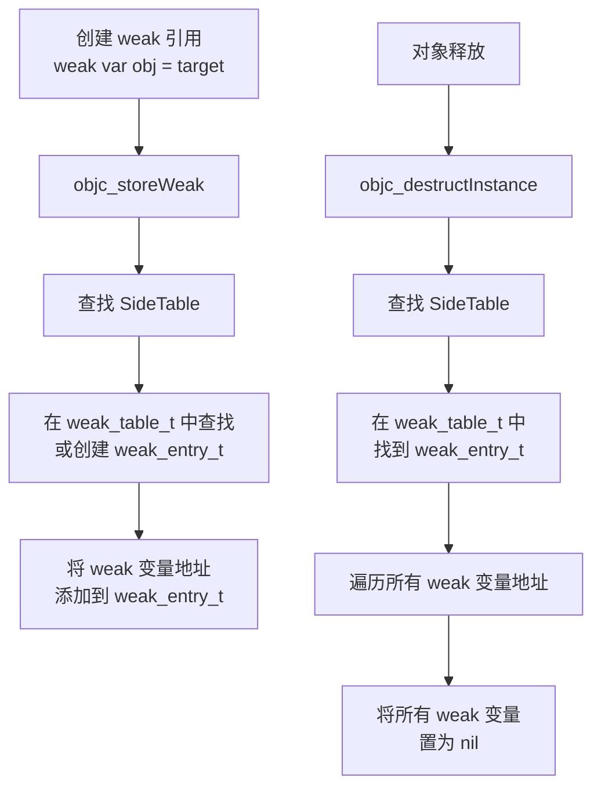

# weak原理

## 概述

weak 关键字用于创建弱引用，不增加对象的引用计数。当对象被释放时，weak 引用会自动置为 nil。

## weak 引用的实现流程



## 关键步骤说明

| 步骤 | 操作 | 说明 |
|------|------|------|
| **1. 创建 weak 引用** | objc_storeWeak | 将 weak 变量地址注册到 SideTable 的 weak_table_t 中 |
| **2. 查找/创建 weak_entry_t** | 在 weak_table_t 中查找 | 通过对象地址（Key）查找对应的 weak_entry_t（Value），如果不存在则创建 |
| **3. 添加 weak 变量地址** | append_referrer | 将 weak 变量的地址添加到 weak_entry_t 的 Value 中（存储 weak 指针地址数组） |
| **4. 对象释放时** | objc_destructInstance | 对象释放时，查找对应的 weak_entry_t |
| **5. 清空所有 weak 引用** | 遍历 weak 变量地址 | 遍历 weak_entry_t 中存储的所有 weak 变量地址，将它们都置为 nil |

## 核心代码逻辑

### 创建 weak 引用

```cpp
// 伪代码：objc_storeWeak
void objc_storeWeak(id *location, id newObj) {
    // 1. 获取对象的 SideTable
    SideTable &table = SideTables()[newObj];
    
    // 2. 在 weak_table_t 中查找或创建 weak_entry_t
    weak_entry_t *entry = weak_entry_for_referent(table.weak_table, newObj);
    if (!entry) {
        // 创建新的 weak_entry_t
        entry = create_weak_entry(newObj);
        weak_table_insert(table.weak_table, entry);
    }
    
    // 3. 将 weak 变量地址添加到 weak_entry_t
    append_referrer(entry, location);  // location 是 weak 变量的地址
}
```

### 对象释放时清空 weak 引用

```cpp
// 伪代码：对象释放时
void objc_destructInstance(id obj) {
    // 1. 获取对象的 SideTable
    SideTable &table = SideTables()[obj];
    
    // 2. 在 weak_table_t 中查找 weak_entry_t
    weak_entry_t *entry = weak_entry_for_referent(table.weak_table, obj);
    if (entry) {
        // 3. 遍历所有 weak 变量地址，将它们都置为 nil
        for (weak_referrer_t *referrer = entry->referrers; 
             referrer != NULL; 
             referrer++) {
            *referrer = nil;  // 将 weak 变量置为 nil
        }
        
        // 4. 从 weak_table_t 中移除该 weak_entry_t
        remove_referrer(entry);
    }
}
```

## 关键理解

- **weak 变量地址**：weak 变量本身也有内存地址，这个地址被存储在 weak_entry_t 中
- **自动置 nil**：对象释放时，通过 weak_entry_t 找到所有 weak 变量的地址，将这些地址存储的值改为 nil
- **不增加引用计数**：weak 引用不会让对象的引用计数 +1，所以不会阻止对象释放
- **必须可选类型**：因为可能为 nil，所以 weak 变量必须是可选类型

## 与 SideTable 的关系

weak 引用的实现依赖于 SideTable：

- SideTable 中的 **weak_table_t** 存储所有对象的 weak 引用信息
- 通过对象地址（Key）查找对应的 **weak_entry_t**（Value）
- weak_entry_t 中存储了所有指向该对象的 weak 变量地址
- 当对象释放时，通过这些地址将所有 weak 变量置为 nil
