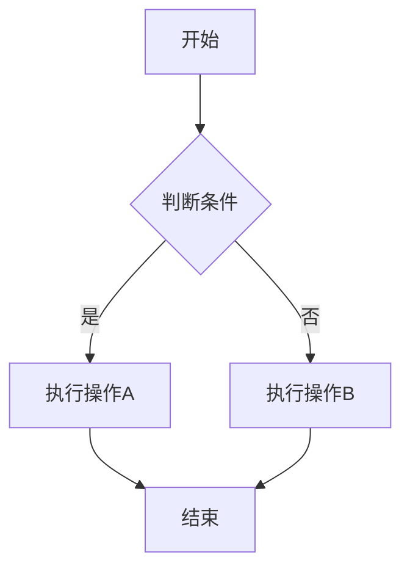
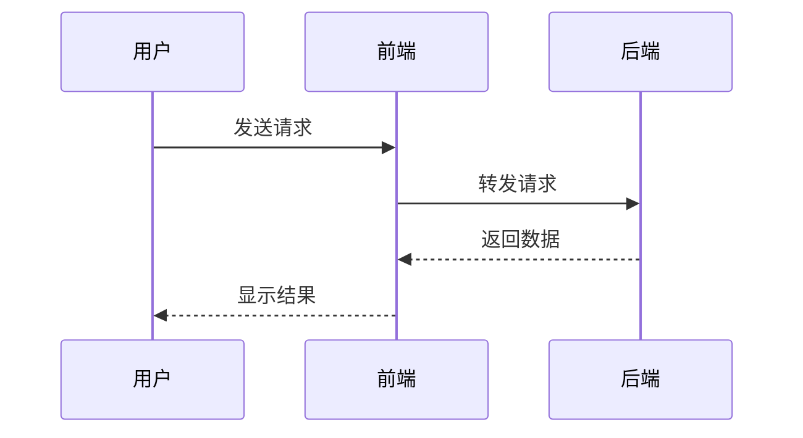
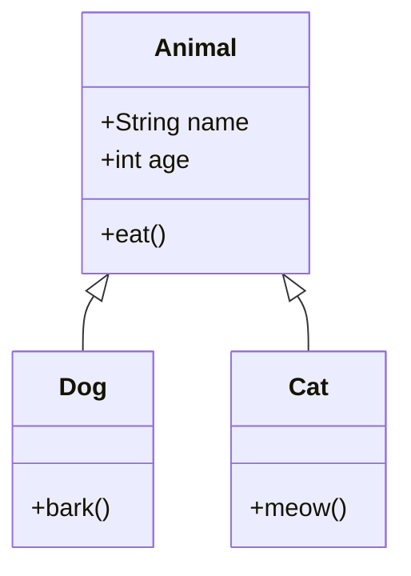
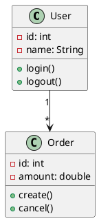

# 图表功能示例

本文档展示了 VuePress 默认主题支持的所有图表类型。

## 1. Mermaid 图表

Mermaid 是一个强大的图表库，支持多种图表类型。

### 1.1. 流程图



### 1.2. 时序图



### 1.3. 类图



## 2. Chart.js 图表

Chart.js 是一个轻量级、易于使用的图表库。

### 2.1. 柱状图

::: chartjs 月度销售额

```json
{
  "type": "bar",
  "data": {
    "labels": ["一月", "二月", "三月", "四月", "五月"],
    "datasets": [
      {
        "label": "销售额",
        "data": [12, 19, 3, 5, 2],
        "backgroundColor": "rgba(54, 162, 235, 0.5)"
      }
    ]
  },
  "options": {
    "responsive": true,
    "plugins": {
      "title": {
        "display": true,
        "text": "月度销售额"
      }
    }
  }
}
```

:::

### 2.2. 折线图

::: chartjs 访问量趋势

```json
{
  "type": "line",
  "data": {
    "labels": ["周一", "周二", "周三", "周四", "周五"],
    "datasets": [
      {
        "label": "访问量",
        "data": [65, 59, 80, 81, 56],
        "borderColor": "rgb(75, 192, 192)",
        "tension": 0.1
      }
    ]
  }
}
```

:::

### 2.3. 饼图

::: chartjs 颜色分布

```json
{
  "type": "pie",
  "data": {
    "labels": ["红色", "蓝色", "黄色", "绿色"],
    "datasets": [
      {
        "data": [30, 25, 20, 25],
        "backgroundColor": [
          "rgb(255, 99, 132)",
          "rgb(54, 162, 235)",
          "rgb(255, 205, 86)",
          "rgb(75, 192, 192)"
        ]
      }
    ]
  }
}
```

:::

## 3. ECharts 图表

ECharts 是一个功能强大的交互式图表库。

### 3.1. 柱状图

```echarts
{
  "title": {
    "text": "ECharts 示例"
  },
  "tooltip": {},
  "xAxis": {
    "data": ["衬衫", "羊毛衫", "雪纺衫", "裤子", "高跟鞋", "袜子"]
  },
  "yAxis": {},
  "series": [
    {
      "name": "销量",
      "type": "bar",
      "data": [5, 20, 36, 10, 10, 20]
    }
  ]
}
```

### 3.2. 折线图

```echarts
{
  "title": {
    "text": "折线图示例"
  },
  "tooltip": {
    "trigger": "axis"
  },
  "xAxis": {
    "type": "category",
    "data": ["Mon", "Tue", "Wed", "Thu", "Fri", "Sat", "Sun"]
  },
  "yAxis": {
    "type": "value"
  },
  "series": [
    {
      "data": [820, 932, 901, 934, 1290, 1330, 1320],
      "type": "line",
      "smooth": true
    }
  ]
}
```

### 3.3. 饼图

```echarts
{
  "title": {
    "text": "饼图示例",
    "left": "center"
  },
  "tooltip": {
    "trigger": "item"
  },
  "series": [
    {
      "name": "访问来源",
      "type": "pie",
      "radius": "50%",
      "data": [
        {"value": 1048, "name": "搜索引擎"},
        {"value": 735, "name": "直接访问"},
        {"value": 580, "name": "邮件营销"},
        {"value": 484, "name": "联盟广告"},
        {"value": 300, "name": "视频广告"}
      ],
      "emphasis": {
        "itemStyle": {
          "shadowBlur": 10,
          "shadowOffsetX": 0,
          "shadowColor": "rgba(0, 0, 0, 0.5)"
        }
      }
    }
  ]
}
```

## 4. Flowchart 流程图

Flowchart 是一个简单的流程图库。

```flowchart
st=>start: 开始
e=>end: 结束
op1=>operation: 操作1
op2=>operation: 操作2
cond=>condition: 判断条件?

st->op1->cond
cond(yes)->op2->e
cond(no)->e
```

## 5. Markmap 思维导图

Markmap 可以从 Markdown 创建思维导图。

```markmap
# VuePress 图表功能
## 6. Mermaid
- 流程图
- 时序图
- 类图
## 7. Chart.js
- 柱状图
- 折线图
- 饼图
## 8. ECharts
- 交互式图表
- 丰富的配置选项
## 9. Flowchart
- 简单的流程图
## 10. PlantUML
- UML 图表
```

## 11. PlantUML UML 图表

PlantUML 用于绘制 UML 图表。

### 11.1. 类图

尝试使用 `uml` 代码块（推荐）：

```uml
@startuml
class User {
  -id: int
  -name: String
  +login()
  +logout()
}

class Order {
  -id: int
  -amount: double
  +create()
  +cancel()
}

User "1" --> "*" Order
@enduml
```

或者使用 `plantuml` 代码块：



### 11.2. 时序图

```uml
@startuml
participant User
participant Frontend
participant Backend
participant Database

User -> Frontend: 请求登录
Frontend -> Backend: 验证用户
Backend -> Database: 查询用户信息
Database --> Backend: 返回用户数据
Backend --> Frontend: 返回验证结果
Frontend --> User: 显示登录结果
@enduml
```

### 11.3. 活动图

```uml
@startuml
start
:用户登录;
if (验证成功?) then (yes)
  :显示主页;
else (no)
  :显示错误信息;
endif
stop
@enduml
```

## 12. 总结

VuePress 默认主题通过 `@vuepress/plugin-markdown-chart` 插件支持以上所有图表类型，功能与 Plume 主题相同。你可以根据需求选择合适的图表库：

- **Mermaid**: 适合流程图、时序图、类图等通用图表
- **Chart.js**: 轻量级，适合简单的数据可视化
- **ECharts**: 功能强大，适合复杂的交互式图表
- **Flowchart**: 简单易用，适合基础流程图
- **Markmap**: 适合思维导图
- **PlantUML**: 适合 UML 图表
