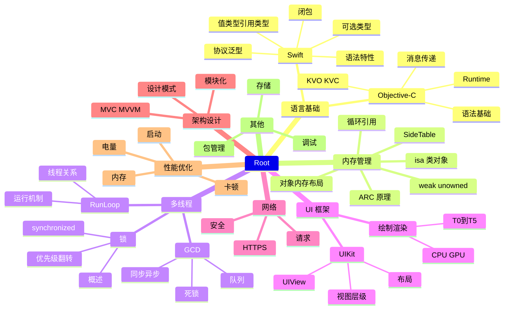
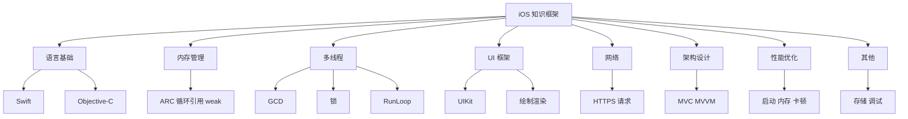

# iOS 知识框架

本文档用多种方式展示 iOS 开发的知识体系，便于对比选择最合适的呈现方式。

---

## 1. Mermaid 思维导图 (mindmap)



---

## 2. Mermaid 流程图 (graph TD 树形)



---

## 3. PlantUML 思维导图 (mindmap)

```uml
@startmindmap
* iOS 知识框架
** 语言基础
*** Swift
**** 语法特性
**** 值类型与引用类型
**** 可选类型
**** 协议与泛型
**** 闭包
*** Objective-C
**** 语法基础
**** 消息传递机制
**** Runtime
**** KVO/KVC
** 内存管理
*** 对象内存布局
*** isa 指针与类对象
*** ARC 原理
*** 循环引用与解决
*** weak/unowned
*** SideTable 结构
*** weak 原理
** 多线程与并发
*** GCD
**** 队列类型
**** 同步与异步
**** 死锁
*** 锁
**** 锁概述
**** 优先级翻转
**** @synchronized 原理
*** RunLoop
**** 运行机制
**** 与线程关系
**** 应用场景
** UI 框架
*** UIKit
**** UIView 体系
**** 视图层级
**** 布局
*** 绘制与渲染
**** T0~T5 阶段
**** CPU vs GPU
** 网络
*** HTTPS
*** 网络请求
*** 安全通信
** 架构与设计
*** MVC/MVVM
*** 设计模式
*** 模块化
** 性能优化
*** 启动优化
*** 内存优化
*** 卡顿排查
*** 电量优化
** 其他
*** 存储
*** 调试
*** 包管理
@endmindmap
```

---

## 4. Markmap 思维导图（可交互）

```markmap
# iOS 知识框架
## 语言基础
### Swift
- 语法特性
- 值类型与引用类型
- 可选类型
- 协议与泛型
- 闭包
### Objective-C
- 语法基础
- 消息传递机制
- Runtime
- KVO/KVC
## 内存管理
- 对象内存布局
- isa 指针与类对象
- ARC 原理
- 循环引用与解决
- weak/unowned
- SideTable 结构
- weak 原理
## 多线程与并发
### GCD
- 队列类型
- 同步与异步
- 死锁
### 锁
- 锁概述
- 优先级翻转
- @synchronized 原理
### RunLoop
- 运行机制
- 与线程关系
- 应用场景
## UI 框架
### UIKit
- UIView 体系
- 视图层级
- 布局
### 绘制与渲染
- T0 代码执行
- T1 Layout
- T2 Display
- T3 Commit
- T4 RenderServer
- T5 GPU 渲染
- CPU vs GPU 绘制
- 绘制框架分层
## 网络
- HTTPS
- 网络请求
- 安全通信
## 架构与设计
- MVC/MVVM
- 设计模式
- 模块化
## 性能优化
- 启动优化
- 内存优化
- 卡顿排查
- 电量优化
## 其他
- 存储
- 调试
- 包管理
```

---

## 5. 表格

| 大类 | 子类 | 知识点 |
| --- | --- | --- |
| 语言基础 | Swift | 语法特性、值类型与引用类型、可选类型、协议与泛型、闭包 |
| 语言基础 | Objective-C | 语法基础、消息传递机制、Runtime、KVO/KVC |
| 内存管理 | - | 对象内存布局、isa 指针与类对象、ARC 原理、循环引用与解决、weak/unowned、SideTable 结构、weak 原理 |
| 多线程与并发 | GCD | 队列类型、同步与异步、死锁 |
| 多线程与并发 | 锁 | 锁概述、优先级翻转、@synchronized 原理 |
| 多线程与并发 | RunLoop | 运行机制、与线程关系、应用场景 |
| UI 框架 | UIKit | UIView 体系、视图层级、布局 |
| UI 框架 | 绘制与渲染 | T0~T5 阶段、CPU vs GPU 绘制、绘制框架分层 |
| 网络 | - | HTTPS、网络请求、安全通信 |
| 架构与设计 | - | MVC/MVVM、设计模式、模块化 |
| 性能优化 | - | 启动优化、内存优化、卡顿排查、电量优化 |
| 其他 | - | 存储、调试、包管理 |
