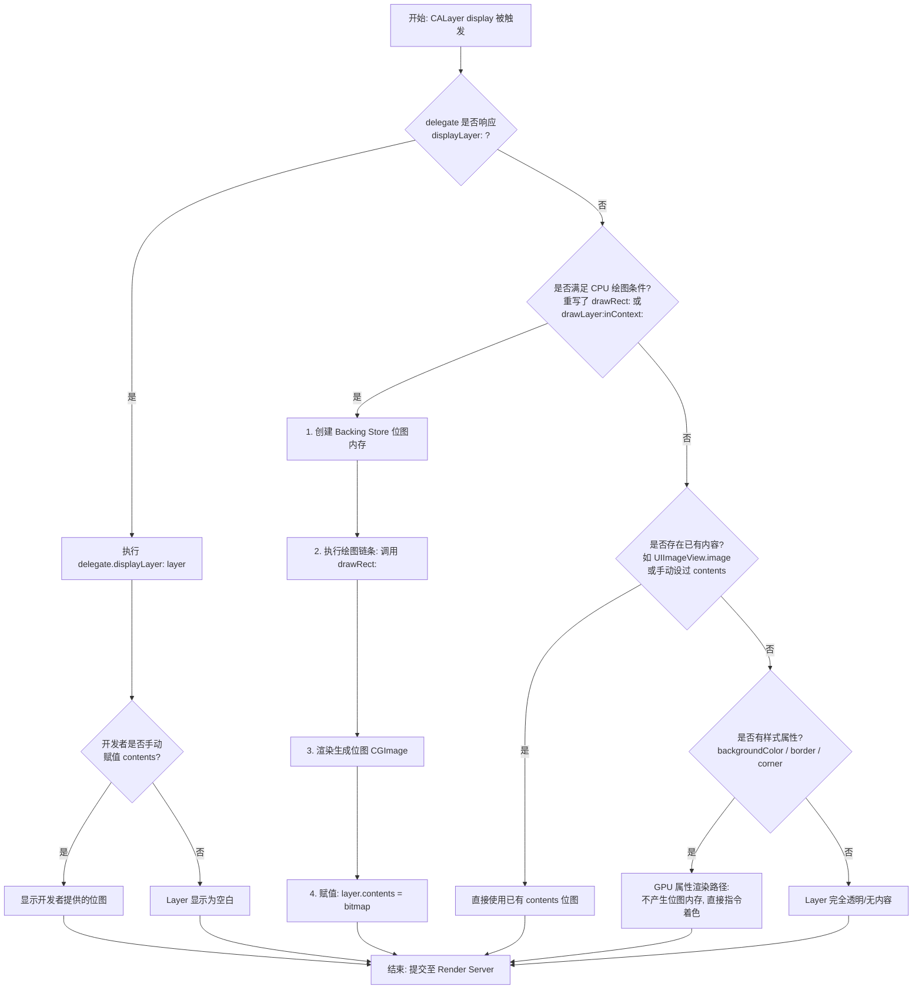

# T2：Display 阶段（生成 bitmap）

| 项目 | 内容 |
|------|------|
| **时间点** | Layout 阶段之后，RunLoop 进入休眠前 |
| **触发时机** | RunLoop 的 `kCFRunLoopBeforeWaiting` 阶段，或者手动调用 `displayIfNeeded()` 时 |
| **这个阶段发生了什么** | 1. 检查哪些 Layer 需要 Display（系统检查所有被标记为"需要显示"的 Layer）<br>2. CALayer 的 display 方法被调用（对于被标记的 Layer，系统会调用 `display(_:)` 方法，这个方法负责生成 bitmap 并存入 `contents`） |

## CALayer 的 display 方法流程

`[CALayer display]` 方法被调用时，会根据 delegate 的实现情况，走不同的绘制路径：



**关键点说明**：

1. **第一个判断**：`displayLayer:` 方法
   - 如果实现了 → 走完全自定义/异步绘制入口（路径 A）
   - 系统完全放手，不创建上下文，不调用 drawRect
   - 开发者必须手动给 `layer.contents` 赋值
   - 如果没实现 → 走系统接管流程（路径 B）

2. **系统接管流程中的关键判定**：是否需要 CPU 绘图？
   - 系统会先检查：是否覆写了 `drawRect:` 或实现了 `drawLayer:inContext:`
   - 如果不需要 CPU 绘图（极速路径）：
     - 不创建 Backing Store，不产生位图内存
     - 直接结束，GPU 根据 `backgroundColor` 等属性直接着色
     - 这是 90% 普通 UIView 的状态，内存开销极低
   - 如果需要 CPU 绘图（降级路径）：
     - 创建 Backing Store（开辟内存：宽 × 高 × 4 字节）
     - 调用绘图链条（`drawLayer:inContext:` 或 `drawRect:`）
     - 生成位图，存入 `layer.contents`

3. **drawRect: 的调用条件（唯一路径）**：
   - delegate 没有实现 `displayLayer:`（否则走异步绘制）
   - 系统判定需要 CPU 绘图（覆写了 `drawRect:` 或实现了 `drawLayer:inContext:`）
   - delegate 没有实现 `drawLayer:inContext:`（否则走 drawLayer:inContext:）
   - delegate 是 UIView（否则不会调用 drawRect:）
   - UIView 覆写了 `drawRect:` 方法
   - 结论：只有同时满足以上所有条件，才会调用 `drawRect:`

## 三种不同的 Display 路径

| 路径 | Layer | 显示方式 | 说明 |
|------|-------|---------|------|
| **路径 A** | UIButton 自身的 Layer | GPU 直接渲染 | 只设置了 `backgroundColor`、`cornerRadius` 等属性，不生成 bitmap，`contents` 保持为 nil |
| **路径 B** | UIImageView 的 Layer | 图片解码成 bitmap | 图片文件（PNG/JPEG）需要解码成未压缩的 bitmap，解码后的 bitmap 赋值给 `layer.contents` |
| **路径 C** | UILabel 的 Layer | 文字光栅化成 bitmap | Core Text 根据字体、字号、行距等属性进行排版，排版结果光栅化成 bitmap，bitmap 存入 `layer.contents` |

## 光栅化是什么？

**光栅化（Rasterization）**：将矢量图形转换成位图（bitmap）的过程。

| 类型 | 定义 | 优点 | 缺点 |
|------|------|------|------|
| **矢量图形** | 用数学公式描述的图形（如文字轮廓、Bezier 曲线） | 可以无限放大不失真 | GPU 无法直接渲染，需要先转换成像素 |
| **位图（bitmap）** | 由像素点组成的图像 | GPU 可以直接渲染 | 放大后会模糊 |

**在 UILabel 中的光栅化过程**：

| 阶段 | 过程 | 说明 |
|------|------|------|
| **1. Core Text 排版** | 矢量阶段 | 根据字体文件（TTF/OTF）中的轮廓数据，计算出文字的矢量轮廓；轮廓是数学曲线，不是像素 |
| **2. 光栅化** | 矢量 → 位图 | 将矢量轮廓"填充"成像素点；根据 Label 的 bounds 大小，创建一个像素网格；判断每个像素点是否在文字轮廓内；如果在轮廓内，就填充颜色（通常是黑色）；如果在轮廓边缘，可能做抗锯齿处理（半透明像素）；最终得到一个 bitmap（像素矩阵） |
| **3. 存入 contents** | 存储位图 | 光栅化后的 bitmap 存入 `layer.contents`；GPU 可以直接读取这个 bitmap 进行渲染 |

## 位图和纹理的关系

| 对比项 | 位图（Bitmap） | 纹理（Texture） |
|--------|---------------|----------------|
| **定义** | 由像素点组成的图像数据 | GPU 内存中的图像数据 |
| **存储位置** | CPU 内存（`layer.contents` 存储的就是位图） | GPU 显存 |
| **存储格式** | 二维数组，每个元素是一个像素的颜色值（RGBA） | GPU 可以直接读取和渲染的格式 |
| **大小计算** | 宽 × 高 × 4 字节（每个像素占用 4 字节 RGBA） | 与位图相同 |
| **本质** | 图像数据本身 | 位图上传到 GPU 内存后，就变成了纹理 |
| **转换过程** | CPU 内存（位图） → 上传到 GPU → GPU 内存（纹理） → GPU 渲染 | - |

**在 iOS 绘制流程中的位置**：

| 阶段 | 操作 | 说明 |
|------|------|------|
| **t2 阶段（Display）** | 生成位图 | 存入 `layer.contents`（CPU 内存）；UILabel：文字光栅化成位图；UIImageView：图片解码成位图 |
| **t3 阶段（Commit）** | 提交数据 | 位图数据随 Layer 信息一起提交到 Render Server |
| **t4 阶段（Render Server）** | 位图上传 | 位图上传到 GPU 内存，变成纹理 |
| **t5 阶段（GPU 渲染）** | 纹理采样 | GPU 从纹理中采样像素，进行渲染 |

## 异步绘制实现示例

如果 delegate 实现了 `displayLayer:` 方法，可以自定义异步绘制逻辑：

```objective-c
// 自定义 CALayer，实现异步绘制
@interface AsyncLayer : CALayer
@property (atomic, assign) BOOL isDrawing;  // 绘制状态标记
@end

@implementation AsyncLayer

- (void)setNeedsDisplay {
    // 收到新的绘制请求时，取消正在绘制的线程
    self.isDrawing = NO;
    [super setNeedsDisplay];
}

- (void)display {
    // 判断 delegate 是否实现了 displayLayer: 方法
    if ([self.delegate respondsToSelector:@selector(displayLayer:)]) {
        // ✅ 走异步绘制入口
        [self asyncDraw];
    } else {
        // ❌ 走系统绘制流程
        [super display];
    }
}

- (void)asyncDraw {
    self.isDrawing = YES;
    
    // 在后台线程进行绘制
    dispatch_async(dispatch_get_global_queue(DISPATCH_QUEUE_PRIORITY_DEFAULT, 0), ^{
        
        // 检查是否被取消
        if (!self.isDrawing) return;
        
        // 1. 创建绘制上下文（后台线程）
        CGSize size = self.bounds.size;
        CGFloat scale = [UIScreen mainScreen].scale;
        UIGraphicsBeginImageContextWithOptions(size, self.opaque, scale);
        CGContextRef context = UIGraphicsGetCurrentContext();
        
        // 2. 设置背景色（如果需要）
        if (self.opaque && self.backgroundColor) {
            CGContextSetFillColorWithColor(context, self.backgroundColor);
            CGContextFillRect(context, CGRectMake(0, 0, size.width * scale, size.height * scale));
        }
        
        // 3. 调用 delegate 的绘制方法（后台线程）
        if ([self.delegate respondsToSelector:@selector(drawLayer:inContext:)]) {
            [self.delegate drawLayer:self inContext:context];
        }
        
        // 4. 检查是否被取消
        if (!self.isDrawing) {
            UIGraphicsEndImageContext();
            return;
        }
        
        // 5. 从上下文生成图片
        UIImage *image = UIGraphicsGetImageFromCurrentImageContext();
        UIGraphicsEndImageContext();
        
        // 6. 在主线程设置 contents
        dispatch_async(dispatch_get_main_queue(), ^{
            if (self.isDrawing) {
                self.contents = (__bridge id)(image.CGImage);
            }
        });
    });
}

@end
```

## 系统绘制 vs 异步绘制

| 特性 | 系统绘制（drawRect） | 异步绘制（displayLayer） |
|------|---------------------|------------------------|
| **触发条件** | delegate 没有实现 `displayLayer:` | delegate 实现了 `displayLayer:` |
| **执行线程** | 主线程 | 可以后台线程 |
| **内存消耗** | 大（backing store） | 大（backing store） |
| **使用场景** | 默认路径，简单绘制 | 复杂绘制，需要性能优化 |
| **是否阻塞主线程** | 是 | 否（如果实现得当） |

**关键点**：

| 要点 | 说明 |
|------|------|
| **路径判断** | `display` 方法中判断 delegate 是否实现了 `displayLayer:`，决定走哪个路径 |
| **异步绘制** | 异步绘制在后台线程创建 context 并绘制 |
| **主线程设置** | 绘制完成后，必须在主线程设置 `layer.contents` |
| **取消逻辑** | 需要处理取消逻辑，避免重复绘制 |
