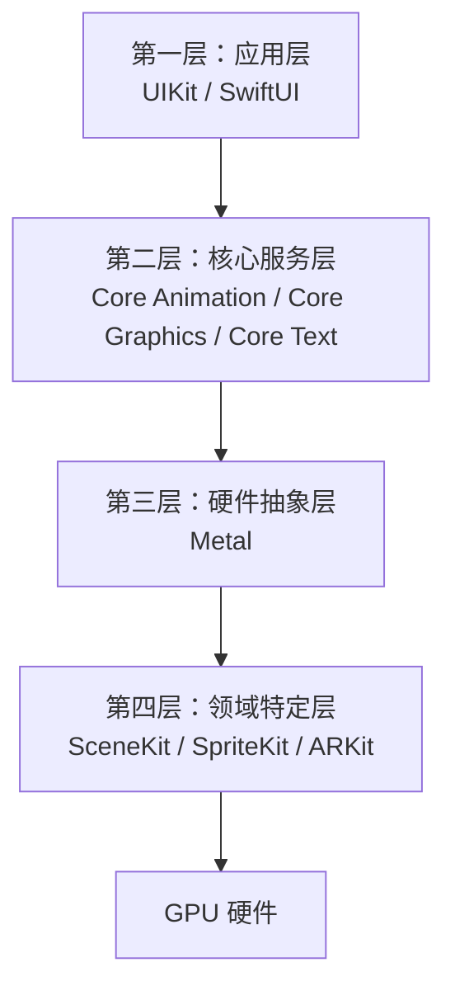
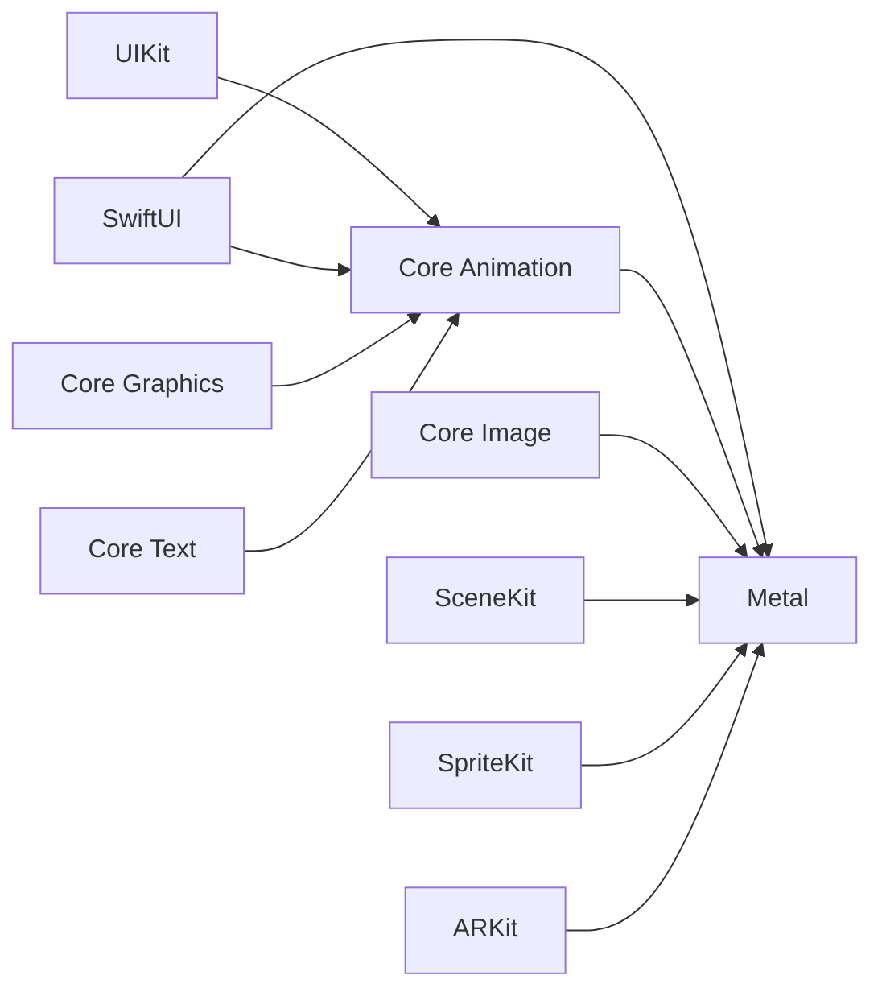

# iOS 绘制框架分层架构

iOS 的图形渲染体系采用分层架构，框架像洋葱一样分层包裹。越上层越易用，越底层性能越高、控制力越强。

## 四层架构概览



## 第一层：应用层（Application Layer）

**特点**：最顶层，也是平时写的最多的。这些框架是对底层渲染能力的高级封装，目的是让开发者能快速构建 UI，不需要关心像素和显卡。

| 框架 | 核心组件 | 主要职责 | 特点 |
|------|---------|---------|------|
| **UIKit** | UIView、UIViewController | 处理用户交互、布局、动画的高级接口 | 本身不直接渲染像素，而是管理 CALayer 图层树 |
| **AppKit** | NSView、NSViewController | macOS 的 UI 框架（UIKit 的 macOS 版本） | 与 UIKit 类似，但针对 macOS |
| **SwiftUI** | View、ViewModifier | 声明式 UI 框架 | 底层混合使用 Core Animation 和 Metal |

## 第二层：核心服务层（Core Services Layer）

**特点**：iOS 图形渲染的引擎，也是区分初级和高级工程师的分水岭。

| 框架 | 核心组件 | 主要职责 | 执行位置 |
|------|---------|---------|---------|
| **Core Animation**<br/>(Quartz Core) | CALayer、CAAnimation | 图层合成引擎，负责把多个图层高效合成 | GPU（合成） |
| **Core Graphics**<br/>(Quartz 2D) | CGContext、CGPath、CGImage | CPU 绘图引擎，2D 矢量绘图，输出位图 | 主要在 CPU |
| **Core Image** | CIImage、CIFilter | 图像处理滤镜库（模糊、色彩调整等） | GPU（并行计算） |
| **Core Text** | CTFrame、CTLine | 文字排版引擎，处理复杂文字渲染 | CPU |
| **TextKit** | NSLayoutManager、NSTextContainer | 高级文字排版框架（基于 Core Text） | CPU |

### Core Animation 的关键作用

**理解 Core Animation 是精通 iOS 渲染的关键**：

- Core Animation 是 UIKit 和 GPU 之间的桥梁
- 几乎所有 iOS 动画都由它驱动
- 性能优化的核心在于减少不必要的 Layer 创建和离屏渲染

## 第三层：硬件抽象层（Hardware Abstraction Layer）

**特点**：直接与 GPU（图形处理器）对话。如果你做游戏引擎、视频播放器或高性能绘图 App，才会用到这里。

| 框架 | 地位 | 主要职责 | 状态 |
|------|------|---------|------|
| **Metal** | 现代 iOS 渲染的基石 | 低开销图形 API，直接与 GPU 对话 | ✅ 推荐使用 |
| **OpenGL ES** | 老一代跨平台图形标准 | 跨平台图形 API | ❌ iOS 12+ 已废弃 |

### Metal 的重要性

Metal 是现代 iOS 渲染的基石：

- 苹果自研的图形 API，直接对标 OpenGL/Vulkan
- 开销极低，能榨干 A 系列芯片的 GPU 性能
- UIKit、Core Animation、Core Image 底层都通过 Metal 实现
- 从 iOS 12 开始，OpenGL ES 已被废弃，Metal 成为唯一的底层图形 API

## 第四层：领域特定层（Domain Specific）

**特点**：基于 Metal 或 OpenGL 封装的专用引擎。

| 框架 | 主要用途 | 底层技术 |
|------|---------|---------|
| **SceneKit** | 3D 游戏引擎（模型、光照、物理） | Metal |
| **SpriteKit** | 2D 游戏引擎（精灵图、物理碰撞） | Metal |
| **ARKit** | 增强现实渲染（结合摄像头和 3D 渲染） | Metal + 摄像头数据 |

## 其他相关框架

| 框架 | 用途 |
|------|------|
| **Image I/O** | 图片编解码（PNG、JPEG、HEIF 等） |
| **PDFKit** | PDF 文档渲染和操作 |
| **MapKit** | 地图渲染（基于 Core Animation） |
| **AVFoundation** | 视频渲染和播放 |

## 框架依赖关系



## 使用场景建议

| 场景 | 推荐框架 | 说明 |
|------|---------|------|
| **99% 的场景** | UIKit / SwiftUI | 日常 UI 开发 |
| **复杂静态图形/文字** | Core Graphics | 报表、PDF 生成 |
| **复杂动画/图层特效** | Core Animation | 卡片翻转、粒子效果 |
| **图片滤镜/修图** | Core Image | 高斯模糊、色彩调整 |
| **游戏/高性能计算** | Metal 或 SpriteKit/SceneKit | 游戏引擎、高性能图形 |

## 各框架的必要性

### Core Animation：必须（对于 UIKit）

| 原因 | 说明 |
|------|------|
| **UIView 底层就是 CALayer** | 每个 UIView 都有一个 CALayer；UIView 的 frame、backgroundColor 等属性实际操作的是 CALayer |
| **UIKit 依赖 Core Animation** | UIKit 的渲染流程：UIView → CALayer → Render Server → GPU；没有 Core Animation，UIKit 无法工作 |

**理论上可以不用**：如果不用 UIKit，直接用 Metal 渲染，但会失去 UIKit 的便利性。

### Core Graphics：大多数情况不需要

| 原因 | 说明 |
|------|------|
| **90% 的 UIView 不走 drawRect** | 系统会先检查是否覆写了 `drawRect:`；如果没有覆写，不会创建 Backing Store，不走 CPU 绘制流程 |
| **系统控件都不走 drawRect** | UIImageView、UILabel、UIButton 等系统控件都不走 drawRect，直接使用 `layer.contents` |

**只有一种情况需要**：当你覆写了 `drawRect:` 方法时。

## 实际开发示例

### 示例 1：普通 UIView（不需要 Core Graphics）

```swift
let view = UIView()
view.backgroundColor = UIColor.blue
// ✅ 不走 drawRect，不需要 Core Graphics
// ✅ 需要 Core Animation（CALayer）
```

### 示例 2：UIImageView（不需要 Core Graphics）

```swift
let imageView = UIImageView(image: UIImage(named: "icon"))
// ✅ 不走 drawRect，不需要 Core Graphics
// ✅ 需要 Core Animation（CALayer）
// 图片解码后直接存入 layer.contents
```

### 示例 3：自定义绘制（需要 Core Graphics）

```swift
class CustomView: UIView {
    override func draw(_ rect: CGRect) {
        // ❌ 只有这种情况才需要 Core Graphics
        let context = UIGraphicsGetCurrentContext()
        // 绘制...
    }
}
```

## 总结

| 框架 | 是否必须 | 使用场景 |
|------|---------|---------|
| **Core Animation** | ✅ 使用 UIKit 时必须 | 所有 UIKit 视图都需要 |
| **Core Graphics** | ❌ 大多数情况不需要 | 只有覆写 `drawRect:` 时才需要 |
| **Metal** | ✅ 底层必须（间接使用） | 所有框架最终都通过 Metal 渲染 |

**关键理解**：

- Core Animation（CALayer）：UIKit 渲染的基础，使用 UIKit 就必须有
- Core Graphics（drawRect）：仅在自定义绘制时使用，大多数情况下不需要
- Metal：现代 iOS 渲染的底层基础，所有框架最终都通过它渲染
