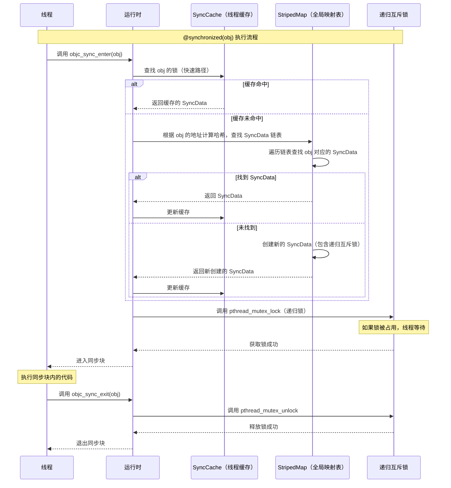
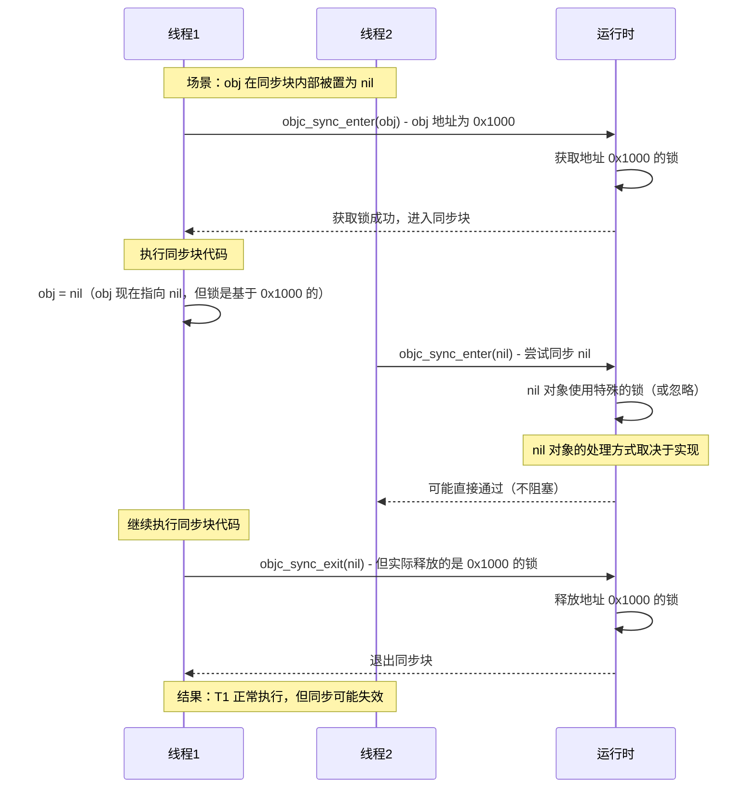

# @synchronized 原理

## 1. @synchronized 是什么

`synchronized` 是 Objective-C 提供的同步指令，用于在多线程环境中保护代码块，确保同一时刻只有一个线程能够执行被保护的代码。

```objective-c
// 基本用法
@synchronized(obj) {
    // 临界区代码
    // 同一时刻只有一个线程能执行这里的代码
}
```

## 2. @synchronized 的实现原理

`synchronized(obj)` 在编译时会被转换为对运行时函数的调用：

### 2.1. 编译后的代码

```objective-c
// 源代码
@synchronized(obj) {
    // 代码块
}

// 编译后等价于
objc_sync_enter(obj);
@try {
    // 代码块
} @finally {
    objc_sync_exit(obj);
}
```

### 2.2. 核心函数

| 函数 | 作用 |
|------|------|
| `objc_sync_enter(obj)` | 获取与对象 obj 关联的锁，如果锁被占用则等待 |
| `objc_sync_exit(obj)` | 释放与对象 obj 关联的锁 |

### 2.3. 内部数据结构

运行时使用以下数据结构来管理锁：

| 数据结构 | 说明 |
|---------|------|
| **SyncData** | 存储锁信息的结构，包含：<br>- 指向下一个 SyncData 的指针（链表结构）<br>- 同步对象的指针（disguised pointer）<br>- 线程计数<br>- 递归互斥锁（pthread_mutex_t，支持递归加锁） |
| **StripedMap&lt;SyncList&gt;** | 分片哈希表，将对象指针映射到 SyncData 链表，减少不同对象之间的锁竞争 |
| **SyncCache** | 线程本地缓存，快速查找最近同步的对象，避免频繁的内存分配 |

### 2.4. 工作流程



### 2.5. 关键特性

| 特性 | 说明 |
|------|------|
| **基于对象地址** | 锁与对象的地址（指针值）关联，不同对象有不同的锁 |
| **递归锁** | 同一线程可以多次对同一对象加锁，需要相同次数的解锁 |
| **自动释放** | 使用 @try/@finally 确保即使发生异常也能释放锁 |
| **性能优化** | 使用线程本地缓存和分片哈希表，减少锁竞争和内存分配 |

## 3. 如果 obj 在同步块内部被置为 nil

这是一个常见的陷阱问题。让我们分析一下会发生什么：

### 3.1. 代码示例

```objective-c
NSObject *obj = [[NSObject alloc] init];

@synchronized(obj) {
    // 在同步块内部将 obj 置为 nil
    obj = nil;
    // 继续执行代码...
}
```

### 3.2. 会发生什么？

| 方面 | 说明 | 结果 |
|------|------|------|
| **当前线程的锁** | 锁是在进入同步块时基于 obj 的原始地址获取的 | ✅ 不会影响当前线程，锁已经获取，会正常释放 |
| **其他线程的行为** | 其他线程尝试用 nil 同步时，会使用不同的锁（nil 对象的锁） | ⚠️ 可能导致同步失效，多个线程可能同时执行 |
| **是否会死锁** | 当前线程已经获取锁，退出时会正常释放 | ❌ 不会死锁 |
| **是否会崩溃** | 运行时处理 nil 对象，不会崩溃 | ❌ 不会崩溃 |

### 3.3. 详细分析



> **关键理解：**
> 
> - **锁是基于对象地址获取的**：进入同步块时，锁已经基于 obj 的原始地址获取
> - **修改 obj 不影响已获取的锁**：当前线程的锁不会受影响，会正常释放
> - **但会导致同步失效**：其他线程使用 nil 同步时，会使用不同的锁，可能导致多个线程同时执行
> - **不会死锁或崩溃**：运行时处理 nil 对象，不会导致死锁或崩溃

### 3.4. nil 对象的处理

根据 Objective-C 运行时的实现，`@synchronized(nil)` 的行为：

| 情况 | 行为 |
|------|------|
| **objc_sync_enter(nil)** | 通常会被忽略或使用特殊的全局锁，不会阻塞 |
| **objc_sync_exit(nil)** | 通常会被忽略，不会释放任何锁 |

> **实际影响：**
> 
> - 如果多个线程都使用同一个对象同步，但在同步块内部将对象置为 nil，会导致同步失效
> - 不同线程可能使用不同的锁（原始对象的锁 vs nil 的锁），无法实现同步
> - 虽然不会死锁或崩溃，但会导致数据竞争和不确定的行为

## 4. 最佳实践

| 实践 | 说明 |
|------|------|
| **使用稳定的对象** | 不要在同步块内部修改或释放同步对象 |
| **避免使用 self** | 使用 `@synchronized(self)` 可能导致死锁，建议使用专门的锁对象 |
| **避免使用 nil** | 不要使用 `@synchronized(nil)`，会导致同步失效 |
| **性能考虑** | `@synchronized` 性能较低，对于高性能场景，考虑使用其他锁（如 os_unfair_lock） |

## 5. 总结

| 问题 | 答案 |
|------|------|
| **@synchronized 如何实现？** | 编译为 objc_sync_enter/exit 调用，运行时使用 SyncData 结构管理对象与锁的映射，使用递归互斥锁实现同步 |
| **obj 在同步块内部被置为 nil 会死锁吗？** | ❌ 不会。锁已经基于原始对象地址获取，退出时会正常释放 |
| **obj 在同步块内部被置为 nil 会崩溃吗？** | ❌ 不会。运行时处理 nil 对象，不会崩溃 |
| **obj 在同步块内部被置为 nil 有什么影响？** | ⚠️ 可能导致同步失效，其他线程使用 nil 同步时会使用不同的锁，无法实现同步 |
